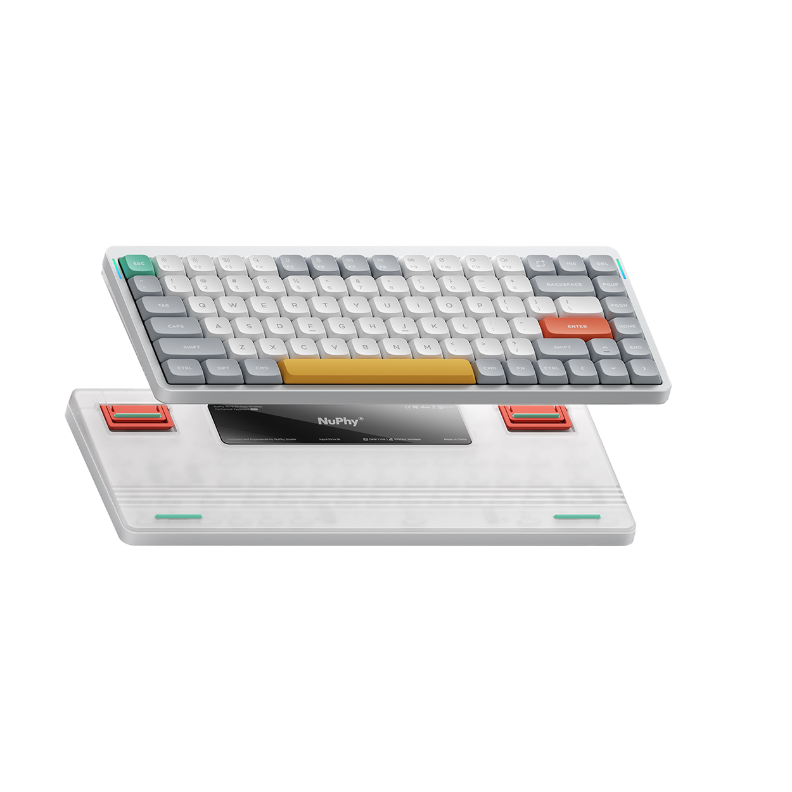

## NuPhy Air75 V2 Keyboard Configuration


My personal config for productivity.

## How to use

Use Chrome to access [usevia.app](https://usevia.app) and load the [design file](https://nuphy.com/pages/json-files-for-nuphy-keyboards). Then load the saved [JSON layout file](./nuphy_air75_v2.layout.json). Layer 0 and 2 correspond to MAC and WIN mode switch. 

## Details

### GACS home row mods

The keys ASDF are assigned as the modifier keys Win Alt Control Shift when held down. Symmetrical application to JKL;
```
Layer 2

A | LT(MOD_LGUI,KC_A)
S | LT((MOD_LALT,KC_S)
D | LT((MOD_LCTL,KC_D)
F | LT((MOD_LSFT,KC_F)
J | LT((MOD_LSFT,KC_J)
K | LT((MOD_LCTL,KC_K)
L | LT((MOD_LALT,KC_L)
; | LT((MOD_LGUI,KC_SCLN)
```
### Caps remapped to backspace + mouse keys

Caps tapped is backspace. Caps held down to use keyboard mouse layer. AWSD for scrolling left, up, down, right. JILK for moving the cursor left, up, right, down. UO for left and right mouse buttons. 
```
Layer 2

CAPS | LT(3,KC_BSPC)

Layer 3

A | KC_MS_WH_LEFT
W | KC_MS_WH_UP
S | KC_MS_WH_DOWN
D | KC_MS_WH_RIGHT

U | KC_MS_BTN1
I | KC_MS_UP
O | KC_MS_BTN2
J | KC_MS_LEFT
K | KC_MS_DOWN
L | KC_MS_RIGHT
```


